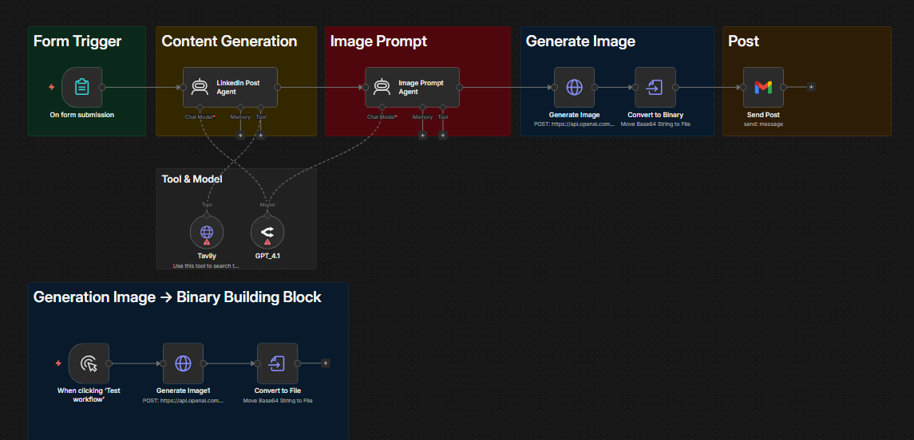

# 🤖 Multi-funktionaler Telegram AI Agent (Text, Voice, Bild)

Dieser Workflow realisiert einen hochintelligenten, multimodalen Telegram-Bot, der in der Lage ist, verschiedene Medienformate zu verstehen und aktiv Aufgaben in Drittsystemen zu steuern.

## 🚀 Funktion
Der Bot fungiert als persönlicher Assistent mit folgenden Kernkompetenzen:

*   **Intelligente Input-Verarbeitung:** Ein Switch-Node erkennt automatisch den Medientyp (Text, Sprache oder Bild) und leitet die Verarbeitung ein.
*   **Multimodalität:** 
    *   **Voice:** Sprachnachrichten werden via **OpenAI Whisper** präzise transkribiert.
    *   **Vision:** Bilder werden via **GPT-4 Vision** analysiert.
    *   **Audio-Output:** Antworten können via Text-to-Speech (TTS) als Sprachnachricht zurückgegeben werden.
*   **Tool-Integration:** Der Agent ist direkt mit dem **Google Workspace** verbunden und kann eigenständig:
    *   E-Mails via **Gmail** versenden.
    *   Termine im **Google Calendar** verwalten.
    *   Daten in **Google Sheets** abfragen oder aktualisieren.
*   **Kontext-Gedächtnis:** Dank **Window Buffer Memory** behält der Bot den Überblick über den Gesprächsverlauf innerhalb einer Session.

## 🛠 Tech-Stack
*   **n8n:** Orchestrierung der Logik und API-Schnittstellen.
*   **OpenAI:** GPT-4 (Intelligence), Whisper (Speech-to-Text), Vision (Bildanalyse), TTS (Sprachausgabe).
*   **Google Workspace:** Gmail, Sheets, Calendar Integration via OAuth2.
*   **Telegram API:** Schnittstelle für die Nutzerinteraktion.

## ⚙️ Setup-Guide

### 1. API & Bot Setup
*   **Telegram:** Erstelle einen Bot über den `@BotFather` und hinterlege den API-Token in n8n.
*   **OpenAI:** Hinterlege deinen API-Key und stelle sicher, dass multimodale Modelle (Vision/Whisper) in deinem Tier freigeschaltet sind.
*   **Google Cloud Console:** Erstelle ein Projekt, aktiviere die APIs für Gmail, Calendar und Sheets und generiere **OAuth2-Credentials** (Client ID & Secret).

### 2. n8n Konfiguration
1. Importiere die `TelegramBot.json` in n8n.
2. Konfiguriere den **System Prompt** des Agent-Nodes, um die Verhaltensweise und Tool-Nutzung zu definieren.
3. Verbinde die Google-Nodes mit deinen OAuth-Credentials.

---
*Dieser Workflow demonstriert die nahtlose Integration von KI-Modellen in tägliche Business-Prozesse.*