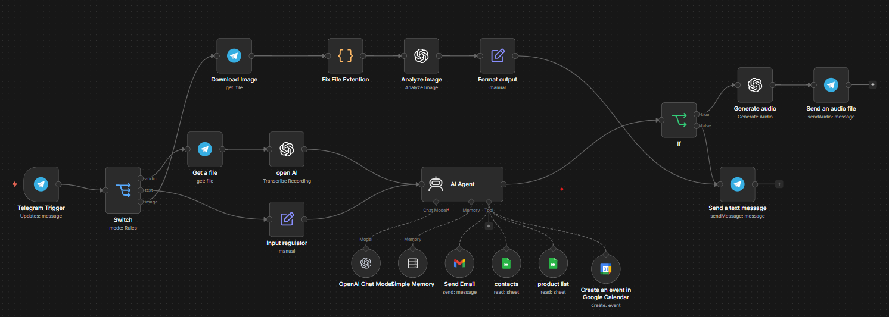

# 🤖 OpenAI Image Gen & LinkedIn Post Automation

Dieses Projekt automatisiert die Erstellung von professionellen, recherchebasierten LinkedIn-Posts inklusive hochwertiger Infografiken. Anstatt manuell in Canva zu designen, ermöglicht dieser Workflow die Generierung von Inhalten in etwa einer Minute, was Marketing-Teams über **10 Stunden Arbeit pro Woche ersparen kann**.

## 🚀 Funktion
Der Workflow übernimmt den gesamten Prozess von der Idee bis zum fertigen Post:

*   **Eingabe:** Über einen n8n Form Trigger gibt der Nutzer das Thema, die Zielgruppe und seine E-Mail-Adresse ein.
*   **Recherche:** Ein KI-Agent nutzt **Tavily**, um das Internet nach aktuellen Fakten und Statistiken zum gewählten Thema zu durchsuchen.
*   **Texterstellung:** Basierend auf der Recherche erstellt ein **GPT-4-Modell** einen strukturierten LinkedIn-Post mit korrekten Quellenangaben.
*   **Bildgenerierung:** Ein spezialisierter "Image Prompt Agent" entwirft einen visuellen Befehl für die **OpenAI Image API**. Diese generiert eine Infografik mit korrektem Text-Rendering.
*   **Datenverarbeitung:** Das als Base64-String empfangene Bild wird in binäre Daten umgewandelt und zusammen mit dem Text via Gmail versendet oder direkt auf LinkedIn gepostet.

## 🛠 Tech-Stack
*   **n8n:** Zentrale Automatisierungsplattform zur Orchestrierung der Workflows.
*   **OpenAI (GPT-4 & Image API):** Intelligente Texterstellung und Generierung von Marketing-Grafiken.
*   **Tavily Search API:** KI-gestützte Websuche für aktuelle Echtzeit-Daten.
*   **Gmail / LinkedIn API:** Automatisierte Distribution der Inhalte.

## ⚙️ Setup-Guide

### 1. API-Konfiguration
*   **OpenRouter/OpenAI:** Erstelle einen API-Key und hinterlege ihn in n8n, um Zugriff auf GPT-4 und die Image-Modelle zu erhalten.
*   **Tavily:** Registriere dich bei Tavily für einen API-Key und nutze diesen im HTTP-Request-Modul zur Autorisierung der Websuche.
*   **ID-Verifizierung:** Stelle sicher, dass dein OpenAI-Organisationskonto verifiziert ist, um die Image API ohne Einschränkungen zu nutzen.

### 2. n8n Workflow-Import
1. Importiere das bereitgestellte JSON-Template (`OpenAI_Image_Gen_LinkedIn_Post.json`) in n8n.
2. Verbinde deine Gmail- oder LinkedIn-Credentials in den entsprechenden Nodes.
3. Stelle sicher, dass nach dem Image-API-Call das Modul **"Convert to File"** genutzt wird, um den Base64-String in eine Bilddatei umzuwandeln.

---
*Entwickelt zur Demonstration von moderner Workflow-Automatisierung und KI-Integration.*